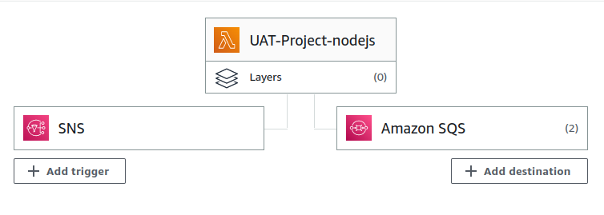
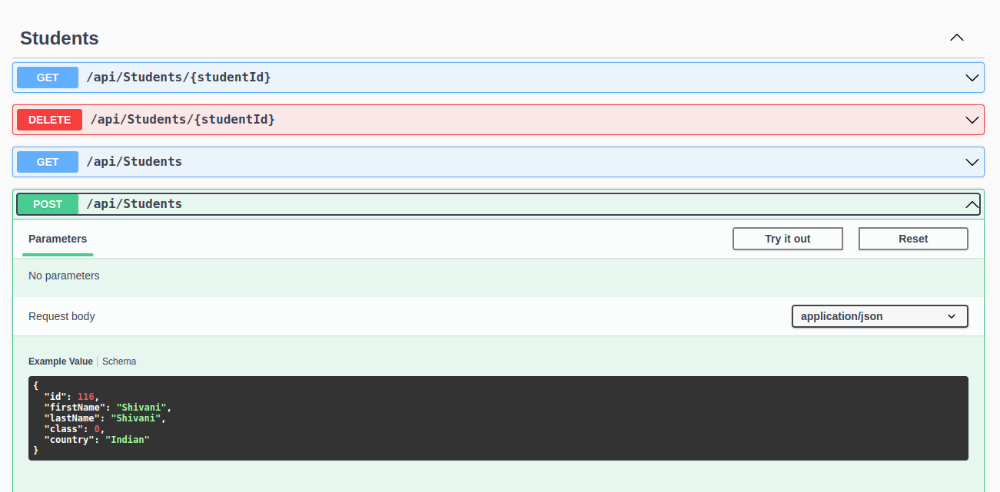

# Problem Statement


## Creating Managed Services
1. DynamoDB
    1. Create table `student`
    1. Set *Partition Key* as `id(Number)`
1. <a id="sns-header"></a> SNS
    1. Create *Standard Topic*. Don't change any other option.
    1. 
1. CloudWatch
    1. Add Alarm with *ReturnedItemCount >= 5 for 1 datapoints within 1 minute*
    1. Configure Action when state is *In Alarm* and trigger [SNS Topic created above](#sns-header)
1. <a id="sqs-header"></a> SQS
    1. Create *Standard Queue*
    1. Let other option be default ones.
1. Lambda
    1. Create *NodeJS 16.x* Lambda function.
        * Choose the *Code* option
        * Leave the default code.
    1. Add *SNS Trigger* 
        * Choose the [SNS Topic created above](#sns-header)
    1. Add *SQS Destination*
        * Choose *Asynchronous invocation*
        * Choose *On success*
        * Select [SQS Queue created above](#sqs-header)
        * 
        
## Setup AWS CLI
1. Create Access Keys from IAM
1. Download AWS CLI
    ```
    curl "https://awscli.amazonaws.com/awscli-exe-linux-x86_64.zip" -o "awscliv2.zip"
    unzip awscliv2.zip
    sudo ./aws/install
1. Verify installation
    ```
    aws --version
1. aws configure
    1. Enter access key and secret
    1. Enter `region (ap-south-1)` and `json`

## NGINX Setup
1. Install NGINX
    ```
    sudo apt install nginx
1. Create NGINX configuration
    ```
    sudo nano /etc/nginx/conf.d/http-3000
1. Copy the following code
    ```
    server { # simple reverse-proxy
        listen       3000;
        server_name  _;
        #access_log   logs/domain2.access.log  main;

        # serve static files
        #location ~ ^/(images|javascript|js|css|flash|media|static)/  {
        #  root    /var/www/virtual/big.server.com/htdocs;
        #  expires 30d;
        #}

        # pass requests for dynamic content to rails/turbogears/zope, et al
        location / {
        proxy_pass      http://127.0.0.1:5214;
        }
    }
1. Restart NGINX
    ```
    sudo systemctl stop nginx
    sudo systemctl start nginx

## Deploying Code
1. Spin up EC2
    1. Choose *Ubuntu 22.04 LTS*
    1. Choose any Instance Type and Key Pair
    1. Allow all HTTPS and HTTP traffic
    1. Configure Storage
    1. Enable *TCP protocol* on *Port 3000*
1. SSH into EC2
1. Execute the command in this [link](#https://github.com/anandshende/.net-samplecode/tree/master/DynamoStudentManager) sequentially


## Running Code
1. Open the URL in browser - http://{{IP}}:3000/swagger
    * Replace {{IP}} with Public IP of EC2
1. Add multiple Students using the following API
    * 
1. Execute the following API continuously (more than 10 times in a minute)
    * .png)

## Verify the Setup
1. Wait for 2-3 minutes
1. After that you can check the following services for entries
    1. AWS DynamoDB
    1. AWS Lambda
    1. AWS SQS


# Documentation
Open in the [Draw.io Diagram](./AWS-CloudWatch) in [draw.io](https://draw.io/)